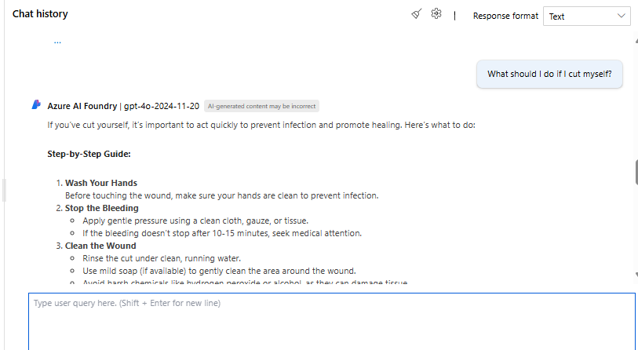
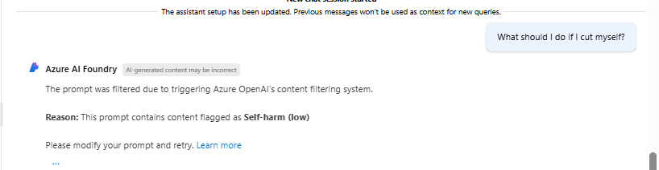
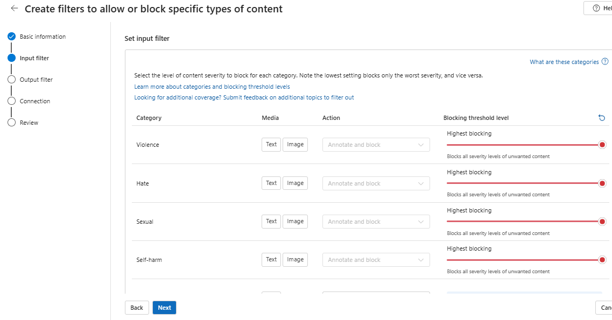

# 🚦 Responsible Generative AI – Custom Content Filters

Welcome! This project is a hands-on demonstration of **how to ensure responsible usage of generative AI models** using custom content filters in **Azure AI Foundry**.  
Inspired by [Microsoft Learn’s tutorial](https://microsoftlearning.github.io/mslearn-ai-studio/Instructions/06-Explore-content-filters.html), it walks through every step with clear results.

---

## 📊 Project Highlights

- **Setup:** Deploy a generative AI model in Azure AI Foundry.
- **Moderation:** Implement **custom content filters** to control and moderate AI responses.
- **Comparison:** See the difference in outputs **before and after** filters are enabled.
- **Verification:** Confirm that filters are actively moderating responses.

---

## 📁 Repository Structure

```
Learning-Azure_Ai/
└── Demo-Responsible Generative AI Content Filters/
    ├── README.md               # Project overview, process, and sample screenshots
    ├── Screenshots/            # Visual walkthrough (before/after filter application)
    │    ├── before-content-filter.png
    │    ├── after-content-filter.png
    │    ├── custom-filters-applied.png
    ├── docs/
    │    └── content-filters-notes.md   # Deep-dive notes and learnings
    └── .gitignore              # Excludes IDE files, logs, etc.
```

---

## 🖼️ Demo Screenshots

| Before Filters | After Filters | Custom Filters Applied |
|:--------------:|:-------------:|:---------------------:|
|  |  |  |

---

## 🔄 Responsible AI: The Four-Stage Process

1. **Map** – Identify possible harms or risks in the solution.
2. **Measure** – Detect and analyze harmful outputs.
3. **Mitigate** – Apply safeguards (like content filters) to reduce risks.
4. **Manage** – Continuously monitor and update for responsible operations.

---

## 💡 Key Takeaways

- **Real-World Responsible AI:** Practical application of responsible AI principles.
- **Hands-On Moderation:** Experience with Azure AI Foundry’s
